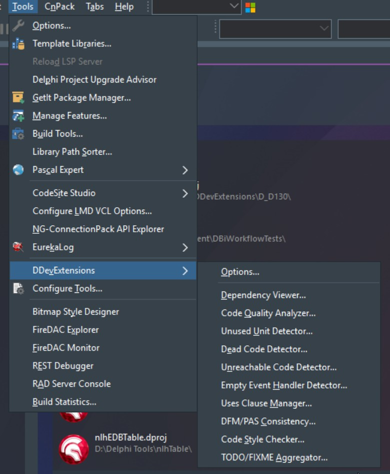

# DDevExtensions

With full acknowledgement of Andreas Hausladen .  His Homepage: https://www.idefixpack.de/ddev

In addition, to anybody else who has contributed over the years.

The Remove PixelsPerInch and Remove TextHeight features (v3.2) are based on work from the DelphiPraxis fork: https://github.com/DelphiPraxis/DDevExtensions

This is a Best Efforts by Ian Branch & Claude code.  No guarantees.  Whilst care has been taken in creating these enhancements, they are probably not perfect.  Use at your own risk/discretion.

DDevExtensions adds new features to RAD Studio.

This version has been extensively re-worked for Delphi 10.2 and up.  Any identified issues have been resolved.  New features have been added.

Version 3.0 was set to clearly break from the old version 2.88. 

Version 3.1 adds code metrics (LOC and Cyclomatic Complexity) to the Build Statistics feature, plus three new code quality tools: TODO/FIXME Aggregator, Code Style Checker, and Dead Code Detector.

Version 3.2 adds two Form Designer options to prevent PixelsPerInch and TextHeight properties from being saved to DFM files, eliminating phantom changes caused by different DPI settings and font rendering across developer machines.

Version 3.3.0 enhances the Dependency Viewer with reverse dependency view ("Used By" mode), dependency depth indicators, improved circular reference analysis showing interface/implementation links with click-to-highlight and double-click-to-open functionality, and a new Impact Analysis panel that shows direct/transitive dependents with risk scoring when you select a unit.

Version 3.3.1 adds the Unreachable Code Detector - a new tool that finds code that can never execute, such as statements after Exit, Raise, Break, Continue, Halt, or Abort calls.

Version 3.4 adds the Smart Uses Clause Manager - automatically analyzes which symbols from each unit are used in the interface vs implementation sections, then recommends or applies changes to move units to their optimal uses clause location.

Version 3.4.1 adds three new features: Interface/Implementation Section Toggle (Ctrl+Shift+Up/Down keyboard shortcut), Empty Event Handler Detector (finds event handlers with empty bodies), and DFM/PAS Consistency Checker (detects mismatches between DFM components and PAS field declarations).

Version 3.5 enhances the Dependency Viewer with conditional compilation support - reads project defines and evaluates `{$IFDEF}`, `{$IFNDEF}`, `{$IF Defined(...)}` blocks to exclude inactive code from analysis, eliminating false positive circular references in multi-app codebases with shared units.

Version 3.5.1 fixes bugs in the Dead Code Detector, Code Style Checker, and Empty Event Handler Detector. The field detection tools now correctly skip the implicit published section of forms (VCL components) and only check fields after an explicit private/protected keyword. The Empty Event Handler Detector now requires event suffixes at the end of method names and correctly detects case/try statements as non-empty. The DDevExtensions submenu has been reordered by workflow (dependency analysis → code quality → style/consistency).

Version 3.5.2 fixes multiple Code Style Checker bugs: field detection now works correctly, method names and parameters are no longer incorrectly flagged as fields, return types and case labels are no longer flagged as parameters, and line number navigation is now accurate. All feature dialogs are now non-modal and open at screen center.

Version 3.6.0 adds two new Code Style Checker rules (Variable Type Prefix Rules and Unit Scope Names) plus the Code Quality Analyzer - a unified tool that detects common code quality issues including magic numbers, hardcoded strings, commented-out code, empty except blocks, catch-all exception handlers, missing try/finally patterns, and potential memory leaks. All detectors are configurable with whitelists and thresholds. See Help.md for details.

Version 3.6.0 enhances the Dependency Viewer with two new features: Export Circular References (export circular reference analysis to CSV or TXT files for external review) and Layer Violation Detection (define architectural layers with pattern-based unit matching and detect forbidden cross-layer dependencies).

Version 3.6.1 fixes a compilation error in Delphi 10.2-10.4 where the Remove PixelsPerInch Property feature would fail to compile because `ReadPixelsPerInch`/`WritePixelsPerInch` methods were introduced in Delphi 11. The feature now works in all supported Delphi versions - in Delphi 10.2-10.4, it reads and discards the PixelsPerInch property from DFM files created in Delphi 11+, allowing cross-version compatibility.

Version 3.6.2 removes dead CodeSite logging code from `RemovePixelsPerInchProperty.pas` (commented-out uses clause and unused conditional block).

Version 3.7.0 adds two major enhancements to the Code Style Checker and Compiler Progress features:

**Code Style Checker Anti-Pattern Detection:**
- Empty Finally Blocks - detects `finally` blocks with no statements
- Nested With Statements - detects `with` statements nested more than one level deep
- Deep Nesting - detects control flow (if/for/while/try) exceeding a configurable depth threshold (default: 4)
- Long Methods - detects methods exceeding a configurable line count (default: 100 lines)
- Long Parameter Lists - detects methods with too many parameters (default: 6)

All anti-pattern checks are individually configurable with customizable thresholds.

**Compiler Progress Style Check Integration:**
- New option to automatically run Code Style Checker after successful compilation
- New "Style Issues" tab in Build Statistics dialog showing all style violations from the last compile
- Full sorting, filtering by category (Naming Convention vs Anti-Pattern), navigation, copy, and export functionality

Version 3.8.0 adds the **IDE Path Sorter** (formerly Library Path Sorter) - a tool to manage and organize Delphi IDE library paths:

- Sort library paths alphabetically in a working panel
- Support for all path types: Library Path, Browsing Path, Debug DCU Path, HPP Output Directory, Namespace Prefixes, Package DCP/DPL Output, and Translated paths
- Support for all platforms (Win32, Win64, etc.)
- Dual-panel interface: read-only original paths and editable working panel
- Manual reordering via Up/Down/Top/Bottom buttons or drag-and-drop
- Delete entries via right-click context menu
- Duplicate path detection with red highlighting
- Click working panel entry to highlight all matching entries in original panel
- Automatic backup before applying changes
- Backup history with restore and delete capabilities
- Access via Tools → "IDE Path Sorter..." (below Build Tools...)

Version 3.9.1 enhances the **IDE Path Sorter** with path loss detection and diagnostics:

- Moved to Tools menu (below Build Tools...) for easier access
- Path counts displayed in panel labels (e.g., "Original Paths: 73", "Working Panel: 73")
- Deleted entry counter tracks manual deletions and compares against actual difference
- Mismatch warning if deleted count differs from expected (indicates unexpected path loss)
- Visual highlighting of paths in the original panel that are missing from the working panel (pink background, maroon bold text)
- "Show Missing Paths..." context menu option to list all paths missing from the working panel
- Resizable Original Panel width via horizontal splitter between panels
- Form position, size, and panel width preserved between sessions
- Fixed potential issue where duplicate paths could be lost during sorting

Version 3.9.2 fixes a bug in the **Options dialog** that prevented it from operating correctly.

Version 3.9.3 fixes the **compile progress bar position** at non-100% display scaling. The reference panel lookup was updated from `pnErrors` to `pnHints` to match the Delphi 12+/13 IDE compile progress dialog layout. DPI scaling (`ScaleForPPI`) and dynamic height (`TotalLines.Height div 2`) are restored, so the progress bar now positions and sizes correctly at all DPI settings (100%, 125%, 150%, etc.).

Version 3.10.3 adds an **About dialog** to the DDevExtensions submenu. "About..." appears as the last item in the menu and displays the plugin name, version, copyright information, and contributors. The dialog is built programmatically using native VCL components and closes with OK or Escape.

Version 3.12.4 adds the **External Mod Monitor** — real-time detection of externally modified files. The Delphi IDE normally only detects external changes when it regains focus. This feature monitors project directories using the Windows `ReadDirectoryChangesW` API and silently refreshes modified files in the IDE within ~200ms, without any external dependencies. Files with unsaved editor changes are never overwritten, and monitoring is automatically suppressed during compilation. Configurable via Tools > DDevExtensions > Options > External Mod Monitor (enabled by default).

Version 3.13.4 enhances the **IDE Path Sorter** with **platform category filter checkboxes**. When many platforms are installed, the Platform dropdown can be filtered by category (Windows, Android, iOS, ARM, macOS, Linux). An "All" checkbox shows all platforms at once. Only categories with installed platforms appear. Checkbox selections persist across sessions.

### Version Number Interpretation

- **First digit** - Major re-write/update
- **Second digit** - Feature change (Add/Modify/Delete)
- **Third digit** - Bug fixes

> **Note:** DDevExtensions only supports the 32-bit IDE (bds.exe).
>
> A 64-bit version was attempted but proved too daunting for Claude and myself.

## Supported Delphi Versions

- Delphi 10.2 Tokyo
- Delphi 10.3 Rio
- Delphi 10.4 Sydney
- Delphi 11.0 Alexandria
- Delphi 12.0 Athens
- Delphi 13.0 Florence

For older Delphi versions (2009-10.1), see the original repository or DelphiPraxis fork.

## Releases

### Delphi 2009-10.2

Releases are available at https://www.idefixpack.de/ddev


## Compile

Open the appropriate `Code\DDevExtensions\D_Dxxx\DDevExtensions.groupproj` for your Delphi version and build all projects.

The project group includes:
1. **CompileInterceptorW** - Compiler interceptor library (built first automatically)
2. **DDevExtensions** - Main extension DLL
3. **DDevExtensionsReg** - Installer application


## How to install

Simply start the DDevExtensionsReg.exe.

This will copy files to $(APPDATA)\DDevExtensions and it registers the expert DLLs
in the registry.


## How to uninstall

Start the InstallDDevExtensions.exe and press the <Uninstall> button.


## Source Structure

```
DDevExtensions/
├── README.md                      # This file
├── LICENSE                        # License file
├── Help.md                        # Help documentation
├── DDevExtensions_Map.html        # Interactive project dependency map (open in browser)
├── enhancements.txt               # Potential future enhancements
├── .gitignore                     # Git ignore rules
│
├── Code/DDevExtensions/           # Main extension project
│   ├── build.bat                  # Build script
│   ├── clean.bat                  # Clean script
│   ├── version.bat                # Version script
│   ├── Version.rc/.res            # Version resource
│   │
│   ├── Bin/                       # Build output
│   │   ├── DDevExtensionsD130.dll # Extension DLL
│   │   ├── DDevExtensionsReg.exe  # Installer
│   │   ├── CompileInterceptorW.dll
│   │   └── Changes.txt            # Version history
│   │
│   ├── D_D102/                    # Delphi 10.2 Tokyo project
│   ├── D_D103/                    # Delphi 10.3 Rio project
│   ├── D_D104/                    # Delphi 10.4 Sydney project
│   ├── D_D110/                    # Delphi 11.0 Alexandria project
│   ├── D_D120/                    # Delphi 12.0 Athens project
│   ├── D_D130/                    # Delphi 13.0 Florence project
│   │   ├── DDevExtensions.dpr
│   │   ├── DDevExtensions.dproj
│   │   ├── DDevExtensions.groupproj
│   │   └── lib/                   # Compiled DCU files
│   │
│   ├── Doc/                       # Documentation
│   │   ├── Features.docx
│   │   └── StartParameters.txt
│   │
│   ├── Installer/                 # Installer project
│   │   ├── DDevExtensionsReg.dpr
│   │   ├── DDevExtensionsReg.dproj
│   │   └── Main.pas/.dfm
│   │
│   └── Source/                    # Main source code
│       ├── Main.pas               # Main plugin registration
│       ├── RegisterPlugins.pas    # Plugin registration
│       ├── PluginConfig.pas       # Configuration base class
│       ├── AppConsts.pas          # Application constants
│       ├── ComponentManager.pas   # Component management
│       ├── CtrlUtils.pas          # Control utilities
│       ├── EditPopupCtrl.pas      # Edit popup control
│       ├── TaskbarIntf.pas        # Windows taskbar interface
│       ├── VirtTreeHandler.pas    # Virtual tree handler
│       ├── Splash.pas/.res        # Splash screen
│       ├── DtmImages.pas/.dfm     # Image data module
│       ├── FrmDDevExtOptions.pas  # Options dialog
│       ├── FrmeBase.pas/.dfm      # Base frame
│       ├── DelphiExtension.inc    # Compiler directives
│       ├── version.inc            # Version include
│       ├── Icon24x24.bmp          # Small icon
│       ├── Icon32x32.bmp          # Large icon
│       │
│       ├── CodeStyleChecker/      # Naming convention checker
│       │   ├── CodeStyleChecker.pas
│       │   ├── FrmCodeStyleChecker.pas/.dfm
│       │   ├── FrmTypePrefixEditor.pas/.dfm  # Variable type prefix rule editor
│       │   └── FrmeOptionPageCodeStyle.pas/.dfm
│       │
│       ├── CompileBackup/         # Pre-compile file backup
│       │   └── FrmeOptionPageCompileBackup.pas/.dfm
│       │
│       ├── CompileProgress/       # Compile progress & Build Statistics
│       │   ├── CompileProgress.pas
│       │   ├── CompilerClearOtherStates.pas
│       │   ├── NativeProgressForm.pas
│       │   ├── UnitMetrics.pas    # LOC and complexity calculation
│       │   ├── FrmBuildStatistics.pas/.dfm
│       │   ├── FrmSwitchToModuleProject.pas/.dfm
│       │   └── FrmeOptionPageCompilerProgress.pas/.dfm
│       │
│       ├── CompilerEnhancements/  # Compiler enhancements
│       │   └── FrmeOptionPageCompilerEnhancements.pas/.dfm
│       │
│       ├── ComponentSelector/     # Quick component search
│       │   ├── ComponentSelector.pas
│       │   └── FrmeOptionPageComponentSelector.pas/.dfm
│       │
│       ├── DeadCodeDetector/      # Unused code detection
│       │   ├── DeadCodeDetector.pas
│       │   ├── FrmDeadCodeDetector.pas/.dfm
│       │   └── FrmeOptionPageDeadCode.pas/.dfm
│       │
│       ├── Debugger/              # Debugger features
│       │   └── StepIntoSkip/
│       │       └── DbgStepIntoSkip.pas
│       │
│       ├── DependencyViewer/      # Unit dependency visualization
│       │   ├── DependencyViewer.pas
│       │   ├── FrmDependencyViewer.pas/.dfm
│       │   ├── FrmLayerConfig.pas/.dfm    # Layer configuration dialog
│       │   └── FrmeOptionPageDependencyViewer.pas/.dfm
│       │
│       ├── DSUFeatures/           # Extended IDE settings
│       │   ├── DSUFeatures.pas
│       │   ├── DisableAlphaSortClassCompletion.pas
│       │   ├── StrucViewSearch.pas
│       │   └── FrmeOptionPageDSUFeatures.pas/.dfm
│       │
│       ├── Editor/                # Editor enhancements
│       │   ├── CodeInsightHandling.pas
│       │   ├── DocModuleHandler.pas
│       │   ├── FocusEditor.pas
│       │   └── FrmReloadFiles.pas/.dfm
│       │
│       ├── ExternalModMonitor/    # Real-time external file change detection
│       │   ├── ExternalModMonitor.pas
│       │   └── FrmeOptionPageExternalModMonitor.pas/.dfm
│       │
│       ├── ExcelExport/           # Excel export functionality
│       │   └── FrmExcelExport.pas/.dfm
│       │
│       ├── FileCleaner/           # Auto-remove unnecessary files
│       │   └── FrmeOptionPageFileCleaner.pas/.dfm
│       │
│       ├── FileSelector/          # File selector dialog
│       │   └── FrmFileSelector.pas/.dfm
│       │
│       ├── FocusEditor/           # Editor focus handling
│       │   └── FocusEditor.pas
│       │
│       ├── FormDesignerHelpers/   # Form designer enhancements
│       │   ├── LabelMarginHelper.pas
│       │   ├── RemoveExplicitProperty.pas
│       │   ├── RemovePixelsPerInchProperty.pas
│       │   ├── RemoveTextHeightProperty.pas
│       │   └── FrmeOptionPageFormDesigner.pas/.dfm
│       │
│       ├── IDEMenuHandler/        # IDE menu handling
│       │   └── IDEMenuHandler.pas
│       │
│       ├── Images/                # Image resources
│       │   ├── DDevExtensionsLogo.bmp/.svg
│       │   └── (other icons and images)
│       │
│       ├── Keybindings/           # Enhanced keyboard shortcuts
│       │   └── FrmeOptionPageKeybindings.pas/.dfm
│       │
│       ├── LibraryPathSorter/     # IDE path management
│       │   ├── LibraryPathSorter.pas
│       │   └── FrmLibraryPathSorter.pas/.dfm
│       │
│       ├── OldPalette/            # Old-style component palette
│       │   ├── ComponentPanel.pas/.res
│       │   ├── OldPalette.pas/.dfm
│       │   └── FrmeOptionPageOldPalette.pas/.dfm
│       │
│       ├── ProjectSettings/       # Project settings management
│       │   ├── ProjectSettings.pas
│       │   ├── ProjectSettingsData.pas
│       │   ├── FrmProjectSettingManageSettings.pas/.dfm
│       │   ├── FrmProjectSettingsEditOptions.pas/.dfm
│       │   └── FrmProjectSettingsSetVersioninfo.pas/.dfm
│       │
│       ├── StartParameterManager/ # Start parameter management
│       │   ├── StartParameterClasses.pas
│       │   ├── StartParameterCtrl.pas
│       │   └── StartParameterManagerReg.pas
│       │
│       ├── StartParameterTeam/    # Team start parameters
│       │   └── FrmeOptionPageStartParameterTeam.pas/.dfm
│       │
│       ├── TodoAggregator/        # TODO/FIXME comment scanner
│       │   ├── TodoAggregator.pas
│       │   ├── FrmTodoAggregator.pas/.dfm
│       │   └── FrmeOptionPageTodoAggregator.pas/.dfm
│       │
│       ├── UnitSelector/          # Find Unit / Use Unit dialog
│       │   └── FrmeOptionPageUnitSelector.pas/.dfm
│       │
│       ├── UnreachableCodeDetector/  # Unreachable code detection
│       │   ├── UnreachableCodeDetector.pas
│       │   ├── FrmUnreachableCodeDetector.pas/.dfm
│       │   └── FrmeOptionPageUnreachableCode.pas/.dfm
│       │
│       ├── UsesClauseManager/     # Smart uses clause optimization
│       │   ├── UsesClauseManager.pas
│       │   ├── FrmUsesClauseManager.pas/.dfm
│       │   └── FrmeOptionPageUsesClause.pas/.dfm
│       │
│       ├── EmptyEventHandlerDetector/  # Empty event handler detection
│       │   ├── EmptyEventHandlerDetector.pas
│       │   ├── FrmEmptyEventHandlerDetector.pas/.dfm
│       │   └── FrmeOptionPageEmptyHandler.pas/.dfm
│       │
│       ├── DfmPasConsistency/     # DFM/PAS consistency checking
│       │   ├── DfmPasConsistency.pas
│       │   ├── FrmDfmPasConsistency.pas/.dfm
│       │   └── FrmeOptionPageDfmPas.pas/.dfm
│       │
│       └── UnusedUnitDetector/    # Unused unit detection
│           ├── UnusedUnitDetector.pas
│           ├── FrmUnusedUnitDetector.pas/.dfm
│           └── FrmeOptionPageUnusedUnitDetector.pas/.dfm
│
├── CompileInterceptor/            # Compiler interceptor library
│   ├── build.bat
│   ├── buildAnsi.bat
│   ├── Bin/                       # Build output
│   │   ├── CompileInterceptor.dll
│   │   └── CompileInterceptorW.dll
│   ├── Example/                   # Example project
│   │   └── ExampleCompileInterceptor.dpr
│   ├── lib/                       # Compiled DCU files
│   └── Source/
│       ├── CompileInterceptorW.dpr/.dproj
│       ├── CompilerHooks.pas
│       ├── FileStreams.pas
│       ├── IdeDllNames.pas
│       ├── InterceptImpl.pas
│       ├── InterceptIntf.pas
│       ├── InterceptLoader.pas
│       └── ToolsAPIIntf.pas
│
├── Shared/                        # Shared utilities
│   ├── FileStreams.pas
│   ├── FileWatcher.pas            # ReadDirectoryChangesW wrapper for file monitoring
│   ├── Hooking.pas
│   ├── ImportHooking.pas
│   │
│   ├── IDE/                       # IDE utilities
│   │   ├── FrmBase.pas/.dfm
│   │   ├── HtHint.pas
│   │   ├── IDEHooks.pas
│   │   ├── IDENotifiers.pas
│   │   ├── IDEUtils.pas
│   │   ├── ModuleData.pas
│   │   ├── ProjectData.pas
│   │   ├── ProjectResource.pas
│   │   ├── ToolsAPIHelpers.pas
│   │   ├── UnitVersionInfo.pas
│   │   └── Options/
│   │       ├── FrmOptions.pas/.dfm
│   │       └── FrmTreePages.pas/.dfm
│   │
│   ├── PascalParser/              # Pascal lexer/parser
│   │   ├── DelphiDesignerParser.pas
│   │   ├── DelphiExpr.pas
│   │   ├── DelphiLexer.pas
│   │   ├── DelphiParser.inc
│   │   ├── DelphiParserContainers.pas
│   │   └── DelphiPreproc.pas
│   │
│   └── Xml/                       # XML utilities
│       ├── SimpleXmlDoc.pas
│       ├── SimpleXmlImport.pas
│       └── SimpleXmlIntf.pas
│
└── Tools/                         # Additional tools
    └── LinkMapFile/
        └── ReadMe.md
```

### Key Files

| File | Purpose |
|------|---------|
| `Code/.../Source/Main.pas` | Registers all plugins with the IDE |
| `Code/.../Source/PluginConfig.pas` | Base class for plugin settings (XML storage) |
| `Code/.../Source/RegisterPlugins.pas` | Plugin registration logic |
| `Shared/PascalParser/DelphiLexer.pas` | Tokenizes Pascal source code |
| `Shared/PascalParser/DelphiDesignerParser.pas` | Extracts class/method structure |
| `Code/.../Source/CompileProgress/UnitMetrics.pas` | Calculates LOC and cyclomatic complexity |
| `Shared/IDE/ToolsAPIHelpers.pas` | Tools API helper functions |
| `Shared/IDE/Options/FrmTreePages.pas` | Options dialog framework |

### Adding a New Feature

1. Create a new folder under `Source/`
2. Create the plugin unit (use existing plugins as templates)
3. Create form/options page if needed
4. Register in `Main.pas` via `RegisterLateLoader`
5. Add units to all D_Dxxx project files


## Menu Structure

All DDevExtensions tools are organized under a single submenu in the Tools menu:

```
Tools
  └── DDevExtensions
        ├── Options...
        ├── ─────────────
        ├── Code Style Checker...
        ├── Dead Code Detector...
        ├── Dependency Viewer...
        ├── DFM/PAS Consistency...
        ├── Empty Event Handler Detector...
        ├── TODO/FIXME Aggregator...
        ├── Unreachable Code Detector...
        ├── Unused Unit Detector...
        └── Uses Clause Manager...
  └── IDE Path Sorter...       (new in 3.9.0 - moved from DDevExtensions submenu)
```



This keeps all DDevExtensions functionality in one convenient location, with the IDE Path Sorter positioned as a general IDE tool in the main Tools menu.

## Features

### Editor

**Disable Source Formatter hotkey** (default: off)
Prevents the IDE's source formatter from being triggered accidentally. Useful if you prefer manual formatting or use a different formatting tool.

**Editor tab double click action** (default: zoom)
Configures what happens when you double-click an editor tab. Options include zooming the editor to full screen or super-zoom mode for distraction-free coding.

**Structure View Search** (default: no hotkey)
Adds a search box to the Structure View panel, allowing you to quickly filter and find methods, properties, and other elements in large units. Assign a hotkey for quick access.

**Enhanced Key Bindings** (default: on)
Provides additional keyboard shortcuts and improved cursor navigation:
- Tab key indents selected lines
- Extended Home key behavior (toggle between start of text and start of line)
- Improved Ctrl+Left/Right word navigation
- Alt+Up/Down to move lines or blocks of code
- Ctrl+Click on identifier to find declaration
- **New in 3.4.1** - Ctrl+Shift+Up/Down to toggle between interface and implementation sections

**Replace Open File At Cursor** (default: off)
Replaces the default "Open File At Cursor" behavior with an enhanced version that provides better file resolution and search capabilities.

### Form Designer

**Set TLabel.Margins.Bottom to zero** (default: on)
Automatically sets the bottom margin of TLabel components to zero when created in the form designer. Prevents unwanted spacing issues in form layouts.

**Remove Explicit\* properties** (default: off)
Prevents ExplicitLeft, ExplicitTop, ExplicitWidth, and ExplicitHeight properties from being saved to DFM files. Reduces form file clutter and avoids merge conflicts in version control.

**New in 3.2 - Remove PixelsPerInch property** (default: off)
Prevents the PixelsPerInch property from being saved to DFM files. Eliminates DPI-related phantom changes when developers with different monitor configurations open the same form.

**New in 3.2 - Remove TextHeight property** (default: off)
Prevents the TextHeight property from being saved to DFM files. Eliminates font-rendering related phantom changes across different machines.

### Component Palette

**Component Selector** (default: off, no hotkey)
Provides a searchable popup dialog for quickly finding and selecting components. Faster than scrolling through the component palette, especially when you know the component name.

### Compiler/Build

**Auto-save editor files after successful compile** (default: off)
Automatically saves all modified editor files after a successful compilation. Ensures your source files are always saved when the build succeeds.

**Switch project to current file's project** (default: on)
When compiling a file that belongs to a different project than the active one, prompts you to switch to that project first. Prevents accidentally compiling with wrong project settings.

**Compile Progress improvements**
Adds a progress bar to the compile dialog and shows compilation progress in the Windows taskbar. Provides visual feedback during long compilations.

**Release compiler unit cache before compiling** (default: off)
Clears the compiler's internal unit cache before each build. Can help resolve rare caching issues at the cost of slightly longer compile times. A "High" option releases even more aggressively.

**File Cleaner** (default: on)
Automatically removes unnecessary files after saving, such as .ddp files and empty Model/History folders. Keeps your project directories clean.

**Compile Backup** (default: on)
Creates backup copies of files before compilation. Provides a safety net in case compilation modifies files unexpectedly.

**New in 3.0 - Build Time Statistics** (default: off)
Tracks how long each unit takes to compile and displays the results in a sortable list. Helps identify slow-compiling units and optimize build times. Features include:
- Per-unit compile time tracking in milliseconds
- **New in 3.1** - Lines of Code (LOC) per unit
- **New in 3.1** - Cyclomatic Complexity per unit (measures code complexity based on decision points)
- Sortable columns (unit name, duration, LOC, complexity, file path)
- Summary statistics: total units, total LOC, average complexity
- Double-click to open unit in editor
- Export to CSV for further analysis
- Copy selected entries to clipboard
- **New in 3.7.0** - Style Issues tab: Shows all Code Style Checker violations from the last compile when "Run style check after compile" is enabled
- **New in 3.7.0** - Style Issues features: Category filter (Naming Convention vs Anti-Pattern), sortable columns, double-click navigation, export to CSV, copy to clipboard
Access via Tools → DDevExtensions → "Build Statistics..." when enabled. Can also auto-show after each compile.

### Project Manager

**Show project for active file in Project Manager** (default: on)
Highlights and expands the project node in Project Manager that contains the currently active editor file. Makes it easier to locate files in large project groups.

**Set Project Versioninfo dialog**
Provides a dialog to set version information across multiple projects in a project group simultaneously. Useful for coordinating version numbers across related projects.

**Project Start Parameters** (default: off)
Allows you to define and manage multiple sets of command-line parameters for running your application. Quickly switch between different debug configurations.

### IDE

**Disable Package Cache** (default: off)
Disables the IDE's package caching mechanism. Can help resolve issues with packages not being reloaded properly after changes.

**Find Unit/Use Unit replacement dialog** (default: on)
Replaces the standard Find Unit and Use Unit dialogs with an enhanced version featuring better search, filtering, and file preview capabilities.

**Improved reload changed files dialog**
Enhances the dialog that appears when external file changes are detected. Provides better information and more control over how changed files are handled.

**New in 3.12.4 - External Mod Monitor** (default: on)
Monitors project directories in real-time for externally modified files and silently refreshes them in the IDE. Unlike the standard IDE behaviour (which only detects changes on focus), this feature uses the Windows `ReadDirectoryChangesW` API to detect changes immediately. Features include:

- Real-time directory monitoring with no external dependencies
- Silent auto-refresh via `IOTAModule.Refresh` — no dialog interruption
- 200ms debounce to prevent reload storms during batch operations (e.g., git checkout)
- Automatically suppresses monitoring during compilation
- Never overwrites files with unsaved editor changes
- Configurable monitored extensions (default: `.pas`, `.inc`, `.dfm`, `.dproj`, `.dpk`)
- Configurable debounce interval
- Reference-counted directory watches (shared across multiple open projects)
- Can be disabled via Options if Embarcadero fixes the IDE's own detection

Configure via Tools → DDevExtensions → Options → External Mod Monitor.

**Show all inheritable modules** (default: off)
Shows all available forms and data modules in the inheritance dialog, not just those from the current project. Useful when inheriting from forms in packages.

**Kill all dexplore.exe when closing the IDE** (default: on)
Automatically terminates any running instances of the Document Explorer (dexplore.exe) when the IDE closes. Prevents orphaned help viewer processes.

**New in 3.0 - Dependency Viewer** (default: off)
Shows a visual tree of unit dependencies within your project. Helps developers understand code structure and identify potential issues. Features include:

- Tree view of all project units with their dependencies
- Separate display of interface and implementation uses clauses
- **New in 3.3.0** - "Uses" / "Used By" view modes - toggle between forward dependencies and reverse dependencies ("what units use this unit?")
- **New in 3.3.0** - Dependency depth indicator - shows how deep each unit sits in the dependency chain (e.g., `[0]` = no project dependencies, `[3]` = depends on units at depth 2)
- Circular reference detection with visual indicators
- **New in 3.3.0** - Units in any circular reference marked with `(!)` prefix in the tree (e.g., `(!) [1] ReportsFrm`)
- **New in 3.3.0** - Enhanced circular reference display showing which uses clause causes each link (`-[I]->` for interface, `-[impl]->` for implementation)
- **New in 3.3.0** - Color-coded circular reference count (green=none, orange=10-99, red=100+)
- **New in 3.3.0** - Click a circular reference to mark those specific cycle members with `>>> <<<` in the tree
- **New in 3.3.0** - Double-click a circular reference to open the first unit in the editor
- **New in 3.3.0** - Auto-sizing tree panel based on longest unit name
- **New in 3.5** - Conditional compilation support - reads project defines and evaluates `{$IFDEF}`, `{$IFNDEF}`, `{$IF Defined(...)}` blocks to exclude inactive code from analysis, eliminating false positive circular references
- **New in 3.3.0** - Impact Analysis panel - select any unit to see:
  - Direct dependents count (units that directly use the selected unit)
  - Transitive dependents count (all units affected, including indirect dependencies)
  - Risk level indicator (Safe/Low/Medium/High) with color-coded visual
- **New in 3.6.0** - Export Circular References: Export all detected circular references to CSV or TXT files for external analysis. CSV format includes unit chains with uses clause types; TXT format provides human-readable reports with detailed chain descriptions.
- **New in 3.6.0** - Layer Violation Detection: Define architectural layers (UI, Business, DataAccess, Core) using unit name patterns with wildcards (* and ?). Configure allowed dependencies between layers in a visual matrix. Detect and report violations where units depend on layers they shouldn't access. Features include:
  - Configurable layers via "Layers..." button
  - Pattern-based unit assignment (e.g., `*Frm` matches all form units)
  - Visual dependency matrix with checkbox rules
  - "Check Layers" analyzes project against rules
  - Color-coded violation count (green=none, orange=10-49, red=50+)
  - Double-click violation to navigate to source unit
  - Export violations to CSV or TXT
  - Default configuration for typical Delphi architecture included
- Double-click tree nodes to open unit in editor
- Expand/collapse for navigation

Access via Tools → DDevExtensions → "Dependency Viewer..." when enabled.

**New in 3.0 - Unused Unit Detector** (default: off)
Scans your project for units in uses clauses that aren't actually referenced in code. Helps reduce compile times and clean up unnecessary dependencies. Features include:

- Detects unused units in both interface and implementation sections
- Shows source file, unused unit name, section, and line number
- Double-click to navigate directly to the uses clause
- Right-click → "Add to Ignore List" to exclude false positives (e.g., component registration units)
- Ignore list also configurable via DDevExtensions Options
- Export results to CSV or copy to clipboard
Access via Tools → DDevExtensions → "Unused Unit Detector..." when enabled.

**New in 3.1 - TODO/FIXME Aggregator** (default: on)
Scans your project for TODO, FIXME, HACK, BUG, NOTE, and other comment markers and displays them in a centralized list. Features include:

- Detects common patterns: TODO, FIXME, HACK, BUG, NOTE, XXX
- Parses optional priority: TODO(high):, FIXME(low):
- Filter by category and priority
- Sortable columns (unit, category, priority, line, text)
- Double-click to navigate to source line
- Export to CSV or copy to clipboard
- Configurable patterns via DDevExtensions Options
Access via Tools → DDevExtensions → "TODO/FIXME Aggregator..." when enabled.

**New in 3.1 - Code Style Checker** (default: on)
Checks your code for Delphi naming convention compliance and common anti-patterns. Features include:

**Naming Convention Rules:**
- Type names should start with T (e.g., TMyClass)
- Interface names should start with I (e.g., IMyInterface)
- Field names should start with F (e.g., FMyField)
- Exception types should start with E (e.g., EMyError)
- Pointer types should start with P (e.g., PMyRecord)
- Parameter names should start with A (optional, off by default)
- **New in 3.6.0** - Variable Type Prefix Rules: Additional check for variable names against custom type-to-prefix mappings (e.g., String=s, Integer=i, Boolean=l). Supports `array of X` syntax. Includes conflict detection when rule patterns overlap.
- **New in 3.6.0** - Unit Scope Names: Flags uses clauses missing scope prefixes (e.g., `SysUtils` should be `System.SysUtils`).

**New in 3.7.0 - Anti-Pattern Detection:**
- Empty Finally Blocks: Detects `finally` blocks with no statements
- Nested With Statements: Detects `with` statements nested more than one level deep
- Deep Nesting: Detects control flow nesting exceeding a configurable depth (default: 4 levels)
- Long Methods: Detects methods exceeding a configurable line count (default: 100 lines)
- Long Parameter Lists: Detects methods with too many parameters (default: 6)

**Results Features:**
- Filter by rule type, category (Naming Convention vs Anti-Pattern), and severity
- Double-click to navigate to source
- Export to CSV or copy to clipboard
- Enable/disable individual rules via DDevExtensions Options
Access via Tools → DDevExtensions → "Code Style Checker..." when enabled.

**New in 3.1 - Dead Code Detector** (default: on)
Detects procedures, functions, and fields that are never referenced in your project. Features include:

- Detects unused procedures and functions
- Detects unused private and protected fields
- Automatically ignores: virtual/override methods, constructors/destructors, event handlers, published members
- Filter by element type (Procedure, Function, Field) and scope
- Wildcard ignore patterns (e.g., *Click, Get*)
- Double-click to navigate to source
- Right-click → "Add to Ignore List" for false positives
- Export to CSV or copy to clipboard
Access via Tools → DDevExtensions → "Dead Code Detector..." when enabled.

**New in 3.3.1 - Unreachable Code Detector** (default: on)
Finds code that can never execute because it follows a statement that always exits the current scope. Features include:

- Detects code after Exit, Raise, Break, Continue, Halt, and Abort calls
- Smart detection: ignores conditional terminators (e.g., `if X then Exit;` - the code after is reachable)
- Case statement aware: recognizes terminators inside case branches (e.g., `0: Exit;` followed by `1: ...`)
- Handles variables named after keywords (e.g., `Continue := False;` is recognized as an assignment)
- Properly skips string literals including Delphi 12+ triple-quoted multi-line strings
- Conditional compilation aware: reads project defines and correctly handles `{$IFDEF}`, `{$IFNDEF}`, `{$IF}`, and `{$ELSE}` blocks
- Shows the project name being scanned
- Shows the reason why the code is unreachable
- Filter by reason type (After Exit, After Raise, After Break, etc.)
- Double-click to navigate to the unreachable line
- Export to CSV or copy to clipboard

**Known Limitations:**
- Complex `{$IF}` expressions (e.g., with `and`/`or` operators) cannot be fully evaluated and the block is skipped
- Assembly blocks with embedded jumps are not analyzed
- Only scans the implementation section (interface section is skipped)

**Note:** This is a static analysis tool and may not catch all cases. Results should always be manually verified before making code changes.

Access via Tools → DDevExtensions → "Unreachable Code Detector..." when enabled.

**New in 3.4 - Uses Clause Manager** (default: on)
Automatically analyzes which symbols from each unit are used in the interface vs implementation sections, then recommends moving units to their optimal uses clause location. Features include:

- Build exports database from project search paths (shows unit count when complete)
- Analyze current unit's identifier usage in interface and implementation sections
- Recommend optimal uses clause placement for each unit
- Show which identifiers from each unit are used and where
- Apply changes with full undo support (Ctrl+Z)
- **Right-click "Move to Recommended Section"** to move selected unit(s) individually
- RTL/VCL priority for ambiguous identifiers (when same identifier is exported by multiple units)
- Export results to CSV or copy to clipboard
- Double-click to navigate to source

**How it works:**
1. Click "Build Database" to scan all units in the project's search path and build an exports database
2. Click "Analyze Unit" to analyze the current file's identifier usage
3. Review the recommendations showing which units should move between uses clauses
4. Click "Apply Changes" to automatically reorganize the uses clauses

**Decision Logic:**
- A unit should be in the **interface** uses clause if ANY of its identifiers appear in the interface section
- A unit should be in the **implementation** uses clause if ALL of its identifiers appear only in the implementation section
- When an identifier is exported by multiple units, RTL/VCL units take priority

**Known Limitations:**
- Ambiguous identifiers may not always be resolved correctly without type information
- Implicit uses (System unit) are not analyzed
- Generic type parameters require full analysis
- First database build is slow (subsequent analyses are fast)

Access via Tools → DDevExtensions → "Uses Clause Manager..." when enabled.

**New in 3.8.0 - IDE Path Sorter** (default: on)
Provides a tool to manage and organize Delphi IDE paths with backup/restore capability. Features include:

- **Dual-panel interface**: Left panel shows original paths (read-only), right panel is editable working area
- **All path types supported**: Library Path, Browsing Path, Debug DCU Path, HPP Output Directory, Namespace Prefixes, Package DCP Output, Package DPL Output, Translated Debug Library Path, Translated Library Path, Translated Resource Path
- **All platforms**: Win32, Win64, and any other platforms configured in the IDE
- **New in 3.13.4** - Platform category filter checkboxes (All, Windows, Android, iOS, ARM, macOS, Linux) with persistent state
- **Sort alphabetically**: One-click alphabetical sorting of paths
- **Manual reordering**: Move entries up/down/top/bottom using buttons or drag-and-drop
- **Delete entries**: Right-click any entry and select "Delete Entry" to remove it
- **Duplicate detection**: Duplicate paths highlighted in red bold text for easy identification
- **Cross-panel highlighting**: Click an entry in working panel to highlight all matching entries in original panel (confirms duplicates existed in original)
- **Automatic backup**: Creates backup before applying changes (configurable)
- **Backup history**: View, restore, or delete previous backups
- **Manual backup**: Create named backups at any time
- **New in 3.9.0** - Path counts displayed in panel labels
- **New in 3.9.0** - Deleted entry counter with mismatch warning
- **New in 3.9.0** - Missing path highlighting (pink background, maroon text)
- **New in 3.9.0** - "Show Missing Paths..." context menu on original panel
- **New in 3.9.0** - Resizable Original Panel via horizontal splitter
- **New in 3.9.0** - Form position, size, and panel width preserved between sessions
- **New in 3.9.1** - Reminder dialog shown when closing after changes applied

**Important Notes:**
- Path order affects unit resolution - the first matching unit found wins
- Always review changes before applying, especially for Library Path
- Backups are stored in `%APPDATA%\DDevExtensions\LibraryPathBackups<DelphiVersion>.xml`
- **For the sorted/reworked paths to take effect, you must close and reopen Delphi**

Access via Tools → "IDE Path Sorter..." (below Build Tools...) when enabled.

**New in 3.4.1 - Empty Event Handler Detector** (default: on)
Finds event handlers that have empty bodies (just begin/end with no code). These are typically leftover from double-clicking components in the form designer. Features include:

- Detects common event handler patterns (OnClick, OnChange, OnCreate, etc.)
- Shows class name, method name, and line number
- Double-click to navigate to source
- **Non-modal dialog**: Stays open while you work in the IDE; clears results when closed
- Export to CSV or copy to clipboard

Access via Tools → DDevExtensions → "Empty Event Handler Detector..." when enabled.

**New in 3.4.1 - DFM/PAS Consistency Checker** (default: on)
Detects inconsistencies between DFM files and their corresponding PAS file field declarations. Catches bugs that can occur after renaming or refactoring. Features include:

- **Missing in PAS**: Component exists in DFM but field is not declared in the form class
- **Missing in DFM**: Field declared in PAS but no corresponding component in DFM (orphaned declaration)
- **Type Mismatch**: Component exists in both but types differ (e.g., TButton in DFM, TLabel in PAS)
- Shows PAS Type/Line and DFM Type/Line for precise navigation (line columns centered)
- **Filter by control type**: Focus on Input Controls (TEdit, TComboBox, TButton - likely need attention) or Passive Controls (TLabel, TPanel - usually safe to ignore)
- Double-click navigation: Opens form designer and selects the component (Missing in PAS) or navigates to PAS declaration (Missing in DFM, Type Mismatch)
- **Non-modal dialog**: Stays open while you work in the IDE; clears results when closed
- Export to CSV or copy to clipboard

**Note:** "Missing in DFM" intelligently filters out:
- Non-component types (TStringList, TList, TBitmap, TThread, etc.)
- Method parameters (correctly skips procedure/function parameter declarations)
- State/activity types (TGridDrawState, TCloseAction, etc.)
- Abstract base classes used as variables (TDataSet, TComponent, TControl)

Not all "Missing in PAS" findings indicate problems - passive controls (TLabel, TPanel) often don't need declarations as they're purely visual.

Access via Tools → DDevExtensions → "DFM/PAS Consistency..." when enabled.

### Debugger

**Don't break when starting spawned processes** (default: off)
Prevents the debugger from breaking into newly spawned child processes. Useful when debugging applications that launch other executables.

**Show confirmation dialog for Ctrl+F1 while debugging** (default: on)
Shows a confirmation prompt before opening context-sensitive help (Ctrl+F1) during a debug session. Prevents accidentally interrupting debugging to view help.

---

*Version: 3.13.4 – 24 March 2026*
